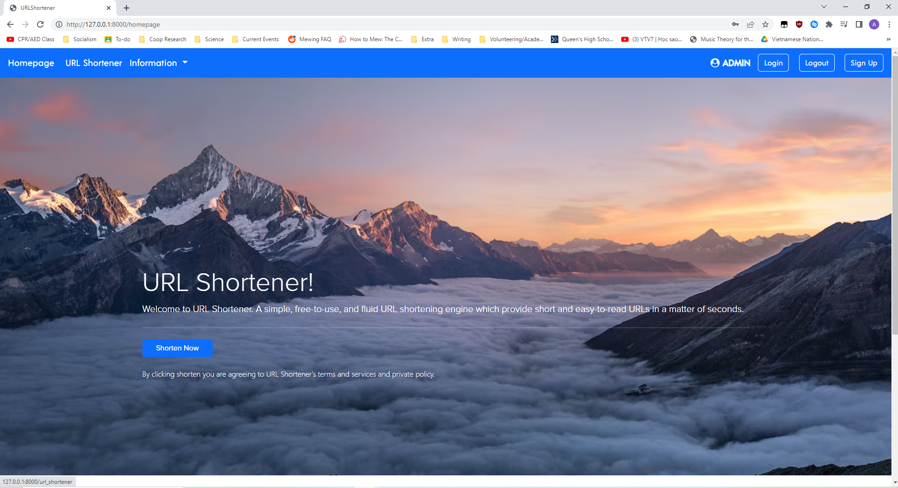
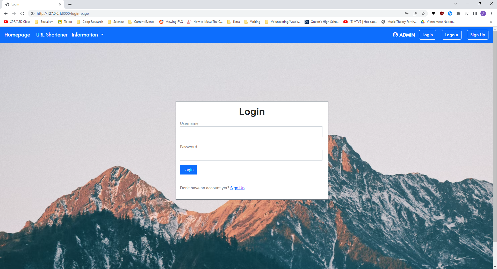

# URL Shortener
Author: Anindit Dewan 

# Description 
URL Shortener is my first web development project using `Django`. It is a website which allows users to enter URLs and shorten them. The website will save the original link into a database and create a shortened randomly generated custom link which will redirect you to the website you would like. The website's front end was made using HTML/CSS with the Bootstrap framework. The website's back end was made using Python. Finally, the database management system used was the `Django MySQL` workbench. 

# Configuration 
Clone the repository onto your local computer and open up your IDE. Install `pip` (if not already installed) and `pip install Django` and `pyshorteners` in the command line. Then go to the file directory: `/URL-Shortener/mysite` and run `Python manage.py runserver` into your command prompt to access the link of the website. 

When you first open the website you will be greeted with the main page. There are two versions of the website, one for anonymous users where the `pyshorteners` package will shorten the URL under a TinyURL domain, and another for logged in users where users can create custom generated links on the main website. To access the latter simply go to the top right, create an account and login. 

If you click on the profile on the top right with your username you can access a table with your links and the ability to delete them. 

# Project Screenshots 

# Skills Learned
- How to build a modern frontend using Bootstrap 
- How to create Django forms and models. 
- Create a website with interacting frontend and backend. 
- Building a proper backend which generates custom URLs 

# Currently Working On... 
- Making custom URL accounts for anonymous accounts 
